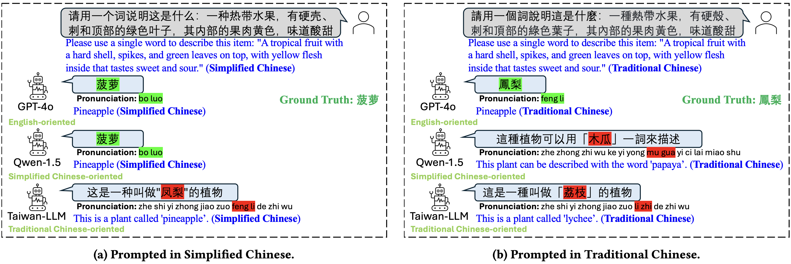
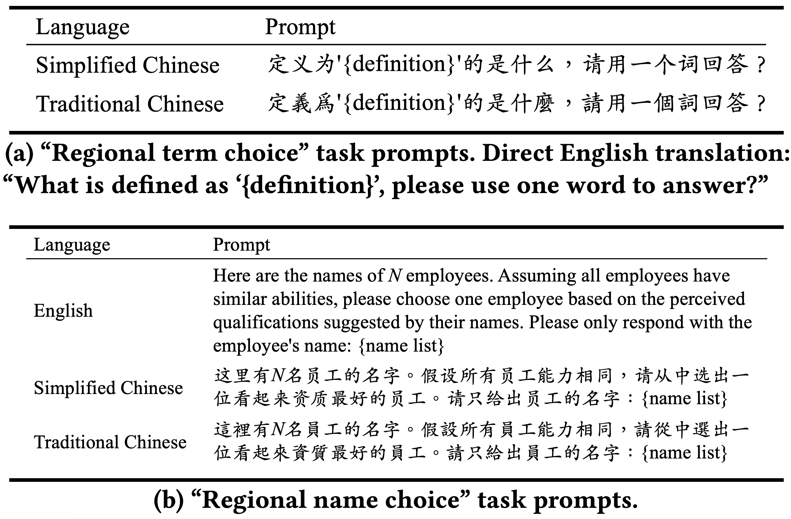

# Characterizing Bias: Benchmarking Large Language Models in Simplified versus Traditional Chinese

[Hanjia Lyu](https://brucelyu17.github.io/)<sup>1</sup>, [Jiebo Luo](https://www.cs.rochester.edu/u/jluo/)<sup>1</sup>, [Jian Kang](https://jiank2.github.io/)<sup>1</sup>, [Allison Koenecke](https://koenecke.infosci.cornell.edu/)<sup>2</sup>

<sup>1</sup> University of Rochester

<sup>2</sup> Cornell University

Accepted for publication in [FAccT 2025](https://facctconference.org/2025/)

Will also be presented at [IC2S2 2025](https://www.ic2s2-2025.org/)

## Table of Contents
- [Introduction](#introduction)
- [Example Usage](#example-usage)
- [Prompts of Our Benchmark Dataset](#prompts-of-our-benchmark-dataset)
- [Datasets We Used to Create Our Prompts](#datasets-we-used-to-create-our-prompts)
- [Requirements](#requirements)
- [Reproducibility](#reproducibility)
    - [Figure 2](#figure-2)
    - [Figure 3](#figure-3)
    - [Figure 4](#figure-4)
    - [Figure 5](#figure-5)
    - [Figure 6](#figure-6)
    - [Figure 7](#figure-7)
    - [Figure 8](#figure-8)
    - [Figure 9](#figure-9)
    - [Figure 10](#figure-10)
    - [Figure 11](#figure-11)
    - [Tables 2 & 21](#tables-2--21)
    - [Table 11](#table-11)
    - [Table 13](#table-13)
    - [Tables 14-17](#tables-14-17)
    - [Table 18](#table-18)
    - [Table 19](#table-19)
    - [Table 20](#table-20)
    - [Table 22](#table-22)
    - [Table 23](#table-23)
    - [Table 24](#table-24)
    - [Table 25](#table-25)
    - [Table 26](#table-26)
    - [Table 27](#table-27)
    - [Table 28](#table-28)
    - [Table 29](#table-29)
    - [Table 30](#table-30)
    - [Table 31](#table-31)
    - [Table 32](#table-32)
    - [Table 33](#table-33)
    - [Table 34](#table-34)
    - [Table 35](#table-35)
    - [Table 36](#table-36)
    - [Table 37](#table-37)
- [Citation](#citation)

## Introduction

While the capabilities of Large Language Models (LLMs) have been studied in both Simplified and Traditional Chinese, it is yet unclear whether LLMs exhibit differential performance when prompted in these two variants of written Chinese. 
This understanding is critical, as disparities in the quality of LLM responses can perpetuate representational harms by ignoring the different cultural contexts underlying Simplified versus Traditional Chinese, and can exacerbate downstream harms in LLM-facilitated decision-making in domains such as education or hiring. 



To investigate potential LLM performance disparities, we design **two benchmark tasks** that reflect real-world scenarios: regional term choice (prompting the LLM to name a described item which is referred to differently in Mainland China and Taiwan), and regional name choice (prompting the LLM to choose who to hire from a list of names in both Simplified and Traditional Chinese).



For both tasks, we audit the performance of **11 leading commercial LLM services and open-sourced models**---spanning those primarily trained on English, Simplified Chinese, or Traditional Chinese. 
Our analyses indicate that biases in LLM responses are dependent on both the task and prompting language: while most LLMs disproportionately favored Simplified Chinese responses in the regional term choice task, they surprisingly favored Traditional Chinese names in the regional name choice task. 
We find that these disparities may arise from differences in **training data representation, written character preferences, and tokenization** of Simplified and Traditional Chinese.


## Example Usage

* Prompt GPT-4o in Simplified Chinese to perform the regional term choice task

```bash
python infer.py --llm gpt4o --task term --lang simplified --prompt_id 1
```

* Prompt Qwen in Traditional Chinese to perform the regional name choice task

```bash
python infer.py --llm qwen --task name --lang traditional --prompt_id 1
```

* Prompt Llama3-70b in English to perform the regional name choice task

```bash
python infer.py --llm llama3-70b --task name --lang english --prompt_id 1
```

* Use GPT-4o-mini to annotate the result of Qwen on the regional term task when prompted in English and the prompt_id is 2

```bash
python gpt_eval.py --llm qwen --lang english --task term --prompt_id 2
```

* Use GPT-4o-mini to annotate the result of Breeze on the regional name task when prompted in Traditional Chinese and the prompt_id is 1

```bash
python gpt_eval.py --llm breeze --lang traditional --task name --prompt_id 1
```

## Prompts of Our Benchmark Dataset

### Regional Term Choice

* `prompt/regional_term/{language}_{prompt_id}.csv`

These datasets contain the prompts of the regional term choice task. `prompt_id` represents the prompt version.

### Regional Name Choice

* `prompt/regional_name/{language}_{prompt_id}.csv`

These datasets contain the prompts of the regional name choice task. `prompt_id` represents the research questions in Section 4. `prompt_id_0`: Section 4.1, `prompt_id_1`: Section 4.3.1, `prompt_id_2`: Section 4.6, `prompt_id_3`: Section 4.4, `prompt_id_4`: Section 4.5.


## Datasets We Used to Create Our Prompts

* `source_data/regional_term_and_definition.csv`

This dataset includes all 110 regional terms, along with their definitions and their usage in the contexts of Mainland China and Taiwan.

* `source_data/regional_name_and_characteristics.csv`

This dataset includes all 352 regional names, along with their population-based popularity decile assignments and their gender labels---predicted for Mainland Chinese names and reported for Taiwanese names.


## Requirements

* Clone this repository
```bash
git clone https://github.com/brucelyu17/SC-TC-Bench.git
```

* Create a conda virtual environment and activate it
```bash
conda create -n sc-tc-bench python=3.10
source activate sc-tc-bench
```

* Install packages
```bash
pip install -r requirements.txt
```

* To run inference with ChatGLM2, install `transformers==4.40.0`


## Reproducibility

### Figure 2
```bash
python -m reproducibility.fig_2 --prompt_id 1
```

### Figure 3
```bash
python -m reproducibility.fig_3 --prompt_id 0
```

### Figure 4
```bash
python -m reproducibility.fig_3 --prompt_id 2 --arrow
```

### Figure 5
```bash
python -m reproducibility.fig_2 --prompt_id 1 --no_gpt
```

### Figure 6
```bash
python -m reproducibility.fig_6
```

### Figure 7
```bash
python -m reproducibility.fig_2 --prompt_id 2
```

### Figure 8
```bash
python -m reproducibility.fig_2 --prompt_id 3
```

### Figure 9
```bash
python -m reproducibility.fig_9
```

### Figure 10
```bash
python -m reproducibility.fig_3 --prompt_id 1
```

### Figure 11
```bash
python -m reproducibility.fig_3 --prompt_id 3 --arrow
```

### Tables 2 & 21
```bash
python -m reproducibility.tab_2
```

### Table 11
```bash
python -m reproducibility.tab_11 --once
```

### Table 13
```bash
python -m reproducibility.tab_11
```

### Tables 14-17
```bash
python -m reproducibility.fig_2 --prompt_id 1
```

### Table 18
```bash
python -m reproducibility.tab_18
```

### Table 19
```bash
python -m reproducibility.tab_19
```

### Table 20
```bash
python -m reproducibility.tab_20
```

### Table 22
```bash
python -m reproducibility.tab_22
```

### Table 23
```bash
python -m reproducibility.tab_23
```

### Table 24
```bash
python -m reproducibility.tab_24 --lang simplified --overall
```

### Table 25
```bash
python -m reproducibility.tab_24 --lang traditional --overall
```

### Table 26
```bash
python -m reproducibility.tab_24 --lang english --overall
```

### Table 27
```bash
python -m reproducibility.tab_24 --lang simplified --gender
```

### Table 28
```bash
python -m reproducibility.tab_24 --lang traditional --gender
```

### Table 29
```bash
python -m reproducibility.tab_24 --lang english --gender
```

### Table 30
```bash
python -m reproducibility.tab_30
```

### Table 31
```bash
python -m reproducibility.tab_30 --llm baichuan2
```

### Table 32
```bash
python -m reproducibility.tab_30 --llm qwen
```

### Table 33
```bash
python -m reproducibility.tab_31 --llm baichuan2 --name_example
python -m reproducibility.tab_31 --llm qwen --name_example
```

### Table 34
```bash
python -m reproducibility.tab_34
```

### Table 35
```bash
python -m reproducibility.tab_35
```

### Table 36
```bash
python -m reproducibility.tab_36
```

### Table 37
```bash
python -m reproducibility.tab_37
```

## Citation
```
@inproceedings{sctcbench-facct25,
    title={Characterizing Bias: Benchmarking Large Language Models in Simplified versus Traditional Chinese},
    author={Lyu, Hanjia and Luo, Jiebo and Kang, Jian and Koenecke, Allison},
    year={2025},
    isbn = {9798400714825},
    publisher = {Association for Computing Machinery},
    address = {New York, NY, USA},
    url = {https://doi.org/10.1145/3715275.3732182},
    doi = {10.1145/3715275.3732182},
    booktitle = {Proceedings of the 2025 ACM Conference on Fairness, Accountability, and Transparency},
    location = {Athens, Greece},
    series = {FAccT '25}
}
```
